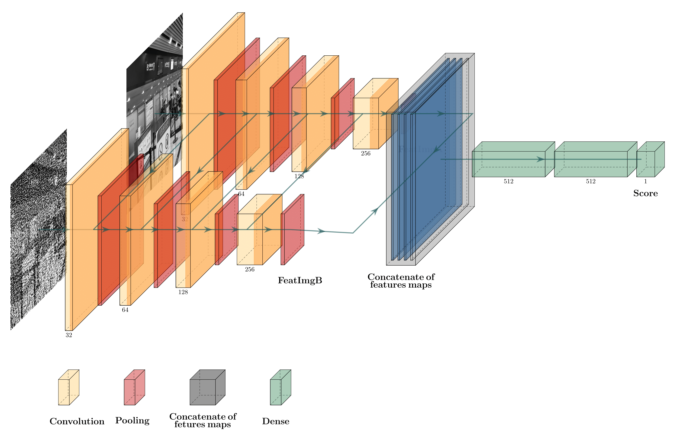

# Image Quality And Visual Security Assessment Siamese-Network

## Dataset

> IVC-SelectEncrypt

The IVC-SelectEncrypt database provides 200 encrypted images from 8 reference gray-scale images of size 720 × 480, encrypted with 5 different encryption schemes at 5 levels of security. 

> Perceptually Encrypted Image Database (PEID)

The PEID database contains 20 reference gray-scale images of size 512 × 512, encrypted using 10 different encryption schemes at 4 to 6 level of perceptually encrypted images, resulting in a total of 1080 encrypted images.

## Purpose: 

## Preprocessing-data

## Model

### Environment

### Library: 

      
### Training

### Testing: 

